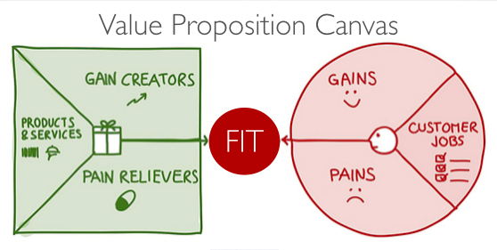
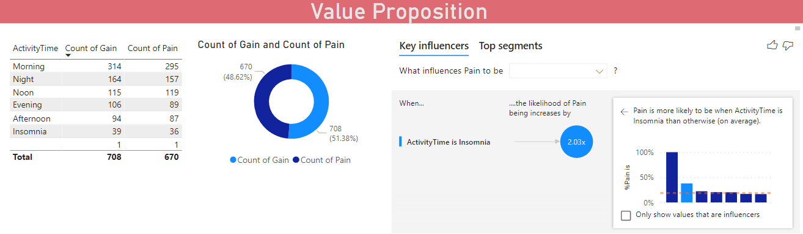

### VALUE PROPOSITION

Survey among classmastes collecting activity data in a period to see what activity we did in the specific time,
including pain and gain from that activity.

The concept of thinking could go fit with new products/service that solving the problems.
For example, if the client like to do work out ay gym everyday coz it's walkable distance BUT the program is too intense.
Business owner can create the variety of program intense in oeder to match client's need.

Regarding the result was collecting in text format, I have little idea to analyze it. :person_frowning:
Anyway, I'd like to summarize something as following.
* There are some blanks for Pain more than Gain so can we infer that the surveyee is an optimistic.
* Label Time to Morning, Noon, Afternoon, Evening, Night, Insomnia and found that Activity time at late night increasing the pain likelihood.

