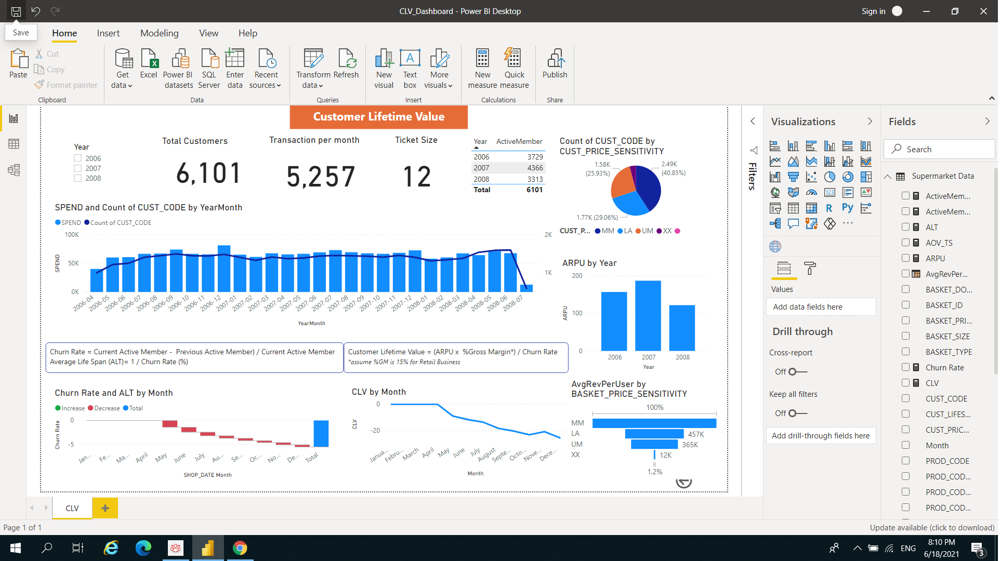

## I'd like to present you the Customer Lifetime Value (CLV) Dashboard :chart_with_downwards_trend:

### Contents
* Total Spend- Bar chart VS Customer number - Line chart
  This will tell you the trend of sale and no. of customers by period e.g. Sales will increasing in December coz it's gifting season :gift:
  
* Average Revenue Per User (ARPU)
  Make us know that how much one user generate revenue per period
  
* Churn Rate, AVG Lifetime Span (ALT) - Waterfall chart
  There is decreasing in both measures and it's highest drop in May
  
* Customer Lifetime Value (CLV)
  It also show the lifetime value of customers
  
* ARPU by customer segment
  MM type which is the majority client (40%) generate revenue more than a half of total :moneybag:
  
  
 
