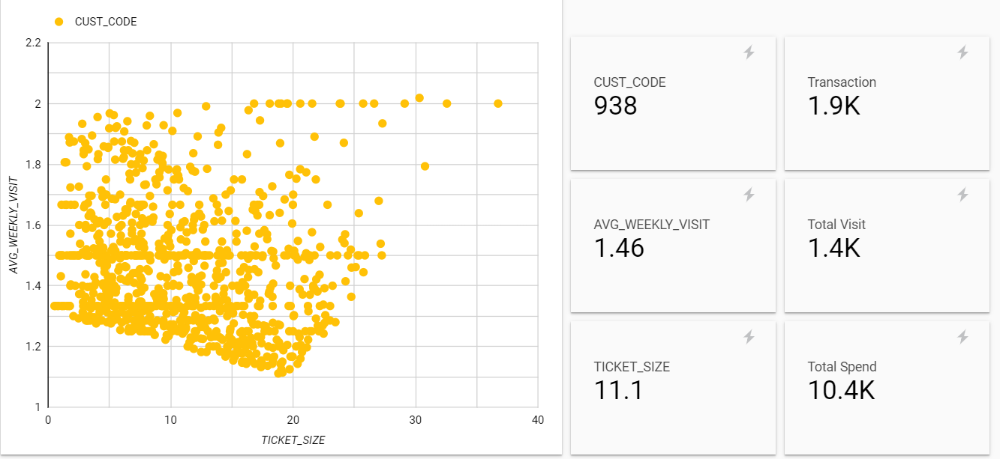
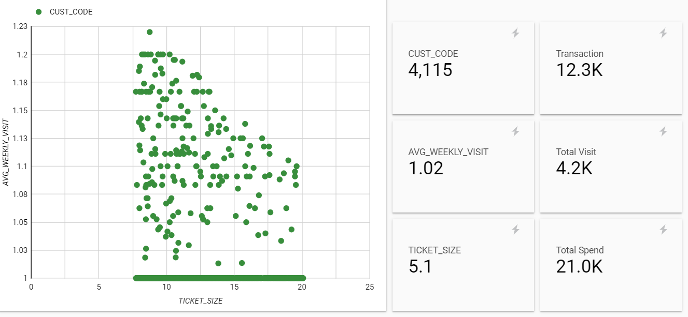

Assignment 6 : Customer Segmentation

Started with the same supermarket file with 956,574 transactions as prior assignment.
ML Method, K-Means will be utilized in order to segment the customers who have similar characteristics into the same group.
I prefer to use only 2 Features which are;
1. Average Weekly Visit - Frequency aspect in RFM
2. Ticket Size - Monetary aspect in RFM

After run K-Means model via Google Big Query, I've got the following 4 customer types.

And then, I'd like to know each customer type more so I use explore data in Google Data Studio.
Group1 (centroid1) *TOP SPENDERs* This group comes once a week with powerful consumption.

Group2 (centroid2) *USUAL CLIENT* This group comes once~twice a week with general consumption. 

Group3 (centroid3) *ON A BUDGET* This group comes once a week with well-prepared budget.  

Group4 (centroid4) *FREEDOM* This group comes alternately with unplanned. But you couldn't do much coz they're really niche/rare.

