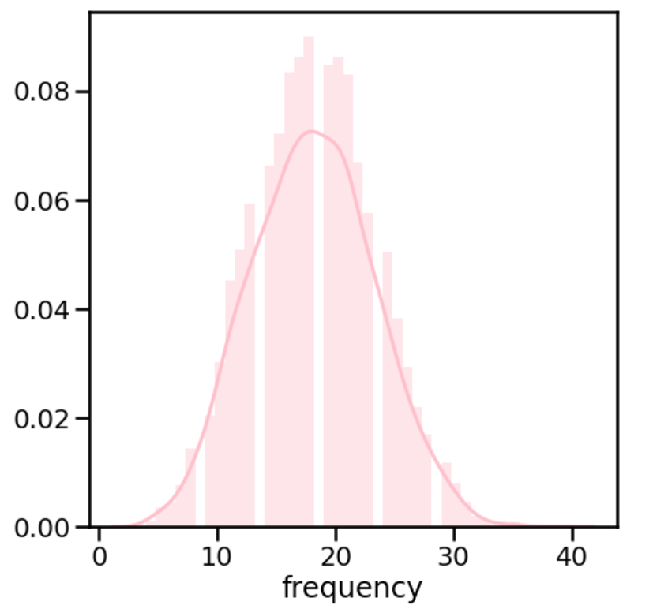

## CAMPAIGN RESPONSE MODEL

DATASET: Retail Dataset Transcations (customer id, transaction date, transction amount)

To predict the response shall the customer redeem coupon or not, RFM model will be utilized.

### STEP1: FIND RFM 
* Recency 
We know that the dataframe has latest transaction date is 16 Mar 2015, 
we then calculate Recency(days) from the gap between the above date and their each latest transaction, and group by customer id

* Frequency
Number of transaction group by customer id

* Monetary
Total spending for all transaction group by customer id

> RESULT1: Descriptive data from overall 6,889 customers
> Recency, Means 80 days, SD 85
>  
>  Frequency, Means 18 days, SD 5
>  
>  Monetary, Means 1,179 days, SD 465
>  

### STEP2: CREATE RFM SCORE
Scoring customer from RFM based on quantile which brings highest score = 4 for P75 above and lowest score = 1 for P25 below
And then plus R|F|M score togeter with full score at 12
> RESULT2: 

### STEP3: DEFINE MOST VALUABLE CUSTOMERS
We believe that customers with high score on RFM should be loyalty and tend to response the campaign prefer to the general or disloyalty one.
So, we cut-off the loyalty at percentile 75 above and list all top customers.
> RESULT3: 

### STEP4: CHECK ACCURACY
> RESULT4: 77.6%

