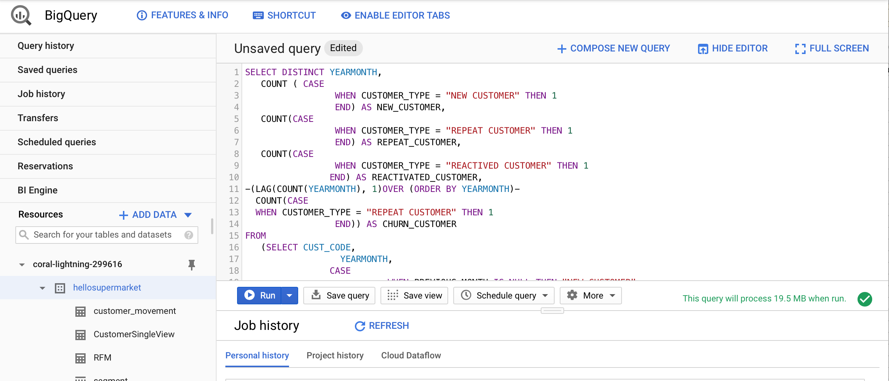
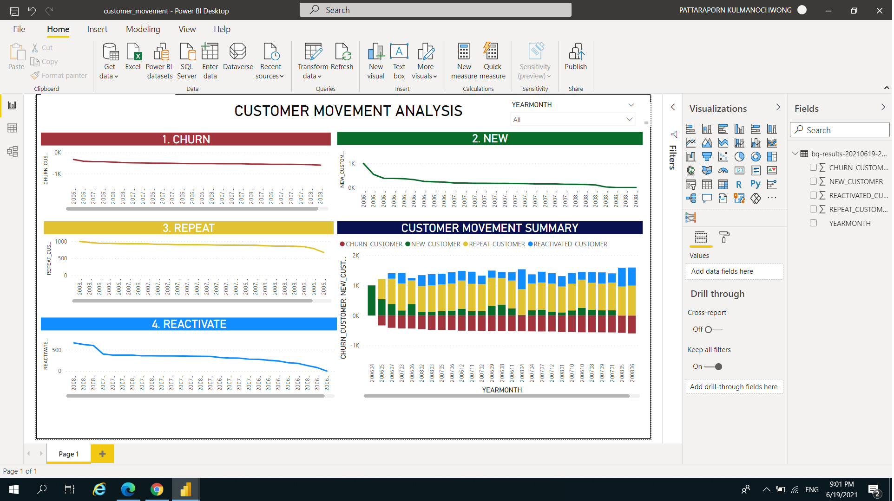

### CUSTOMER MOVEMENT ANALYSIS :bust_in_silhouette:

Another time that we utilize 'Supermarket Data' to see customer movement in the shop !
From the class lecture, Churn Rate calculate from [(Customera at beginning period - Customers at end of period) / Customera at beginning period]
And Customer Retention Rate (CRR) = [(E-N)/S]*100
*E - Number of Customers at end of period
N - Number of Customers acquire during period
S -Number of Customers at start of period*

Then, we will know the Break Even Point (BEP) from [Period Calculation / (Churn + Repeat)

As a result, if we know status of customers, it will very helpful for retention activity.
In addition, customer value is a well-driven decision to valuable Sales/Marketing Activities.

#### STEP TO DO 
1. Utilizing Google BigQuery which is very resourceful tools, running SQL with Big Data with time efficient.

2. SQL code by deviding customers into 4 status:- CHURN, NEW, REPEAT, REACTIVATE
**definition of customer status can be different depending on business occupancy and business life cycle** 

3. Export result to Power BI for data visualization

