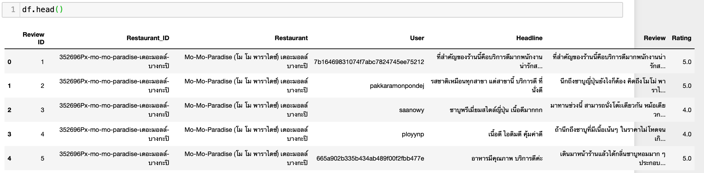
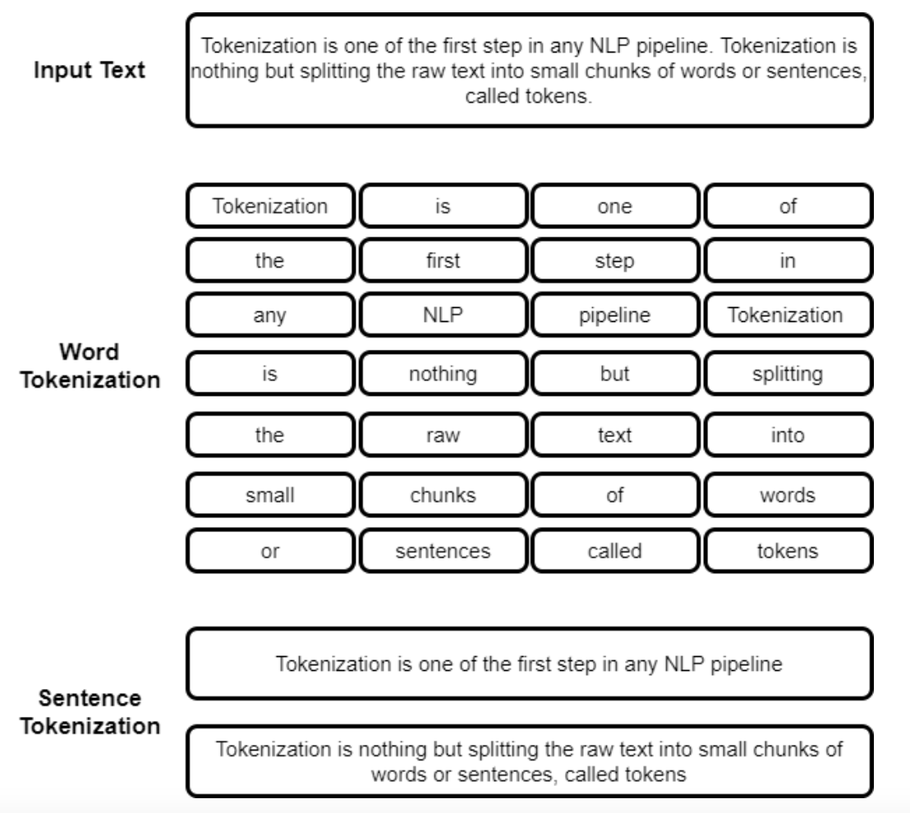
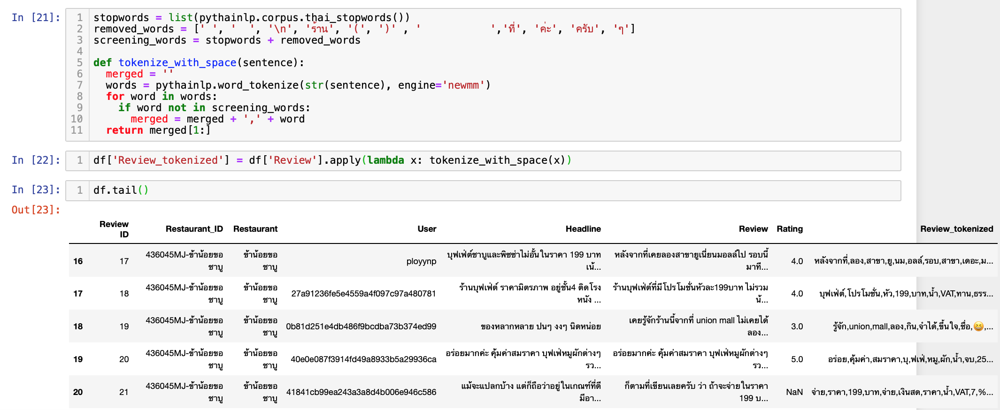
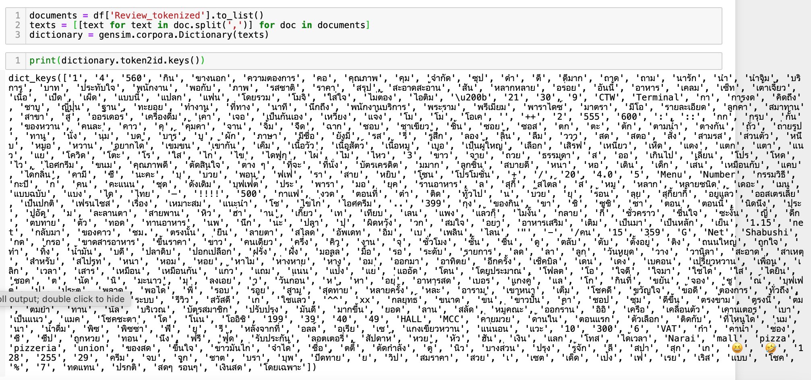
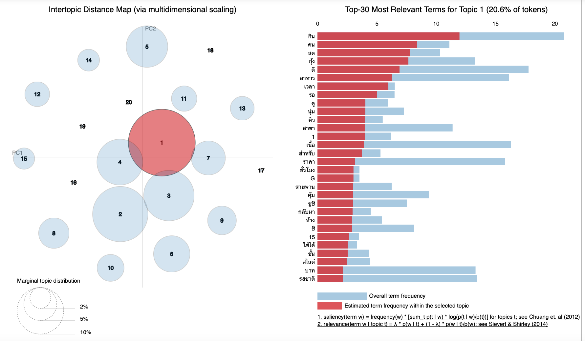

:octocat: Assignment of Voice of Customers Analysis :mega:

Way of Analysis: NLP/ Tokenization
Library used: gensim

Dataset1 -> 20 reviews of Shabu restaurants
Dataset2 -> 299 reviews of various restaurants & cafes

STEP1 IMPORT DATA
:scroll: There are 7 colums in Dataframe :- Review_ID, Restaurant_ID, Restaurant, User, Headline, Review, Rating

STEP2 TOKENIZATION TECHNIQUES

Once we have a list of words we can also use statistical tools and methods to get more insights into the text.
* Using gensim to tokenize the words and sentence accordingly.

* WORD -  Having trick to remove no-meaning word and breakout word by word

          Find frequency in words by counting and let gensim generate the TOP HIT topics
          

          ** The result found normal words like 'กิน', 'คน', 'สด', 'กุ้ง', 'ดี' 
          but analyzing by topic, we can categorize restaurant type/ food type which is very useful for SEO **
          
* SENTENCE - We can go beyond and deep down to match/ group the words and do sentiment analysis.

Credits: Our beloved teacher, Dr.Thanachart R. and incredibly resourceful & energitic BADS7105 class
[Kaggle](https://www.kaggle.com/satishgunjal/tokenization-in-nlp)
